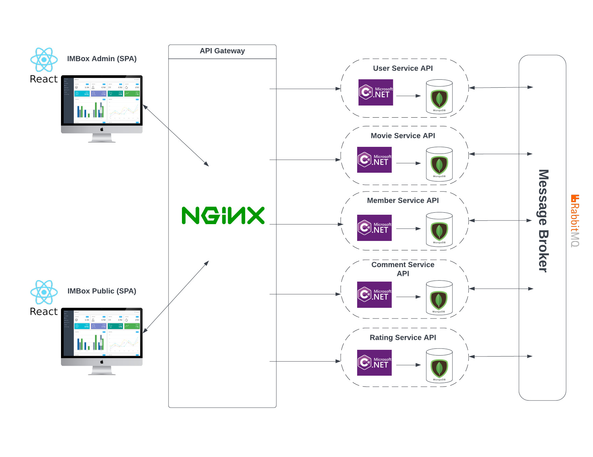

<h1 align="center">IMBox</h1>



## How to run IMBox

### Update config files
Each api service has its own `appsettings.json` file and `appsettings.Development.json` file.
You can run the IMBox Admin project without modifying them but if you want to try user registration
in IMBox Public side, you need to update `SmtpSettings` section in `src/Services/User/User.API/appsettings.json` since it needs to send an email. Recommended way is to use Google smtp server (smtp.gmail.com).

As for the other settings such as database settings and message brokers settings, you can keep them as they are.


### With docker compose for development

#### API servers
For infrastructures including database, message broker and api gateway, `docker-compose.dev.yml` can be used.

```bash
docker-compose -f docker-compose.dev.yml up -d
```

Restore and build the projects with the following commands.

```bash
dotnet restore
```

```bash
dotnet build
```

Run the projects with command below:

```bash
dotnet run --project ./src/Services/<service name>/<service name>.API/IMBox.<service name>.API.csproj --no-build
```

#### Frontends

```bash
cd ./src/Web
```

```bash
yarn install
```

```bash
yarn dev-admin # admin dashboard
```

```bash
yarn dev-public # IMBox public frontend
```

### With docker compose for production

For deployment, you can run `docker-compose.prod.yml` and docker-compose will do everything for you.
```bash
docker-compose -f docker-compose.prod.yml up -d
```
After the deployment finishes, you can access IMBox Public at `http://localhost:5555` and IMBox Admin at `http://localhost:5555/admin`.